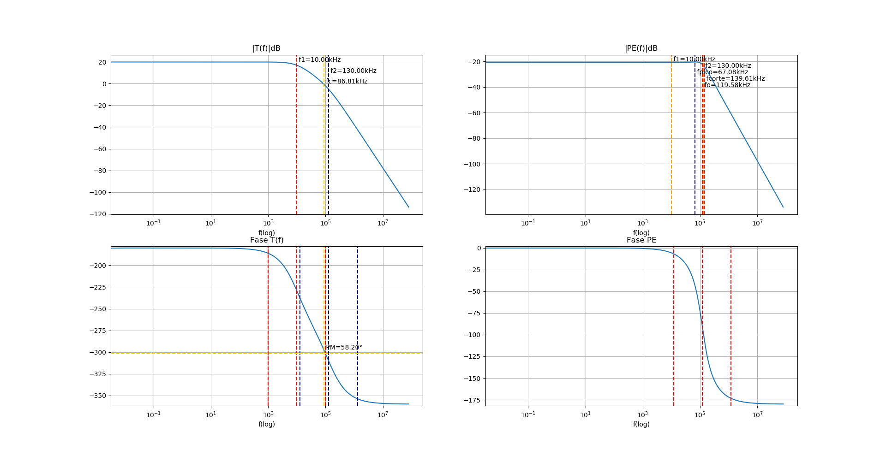

# OpAmp-2do-Orden
Python Script que muestra distintas características de un filtro de segundo orden formado con un LM741 ingresando distintos parámetros.

## Descarga
```sh
$ git clone https://github.com/Quik-e/OpAmp-2do-Orden.git
```

## Parámetros a ingresar:
* Frecuencia del primer polo.
* Frecuencia del segundo polo.
* Parámetro To.
* Parámetro B normalizado.

## Parámetros obtenidos:
* Frecuencia de oscilación.
* Factor de amortiguamiento.
* Frecuencia de cruce.
* Frecuencia de corte.
* Margen de fase.
* Frecuencia de pico.
* Sobrepico de la respuesta en frecuencia.
* Tiempo de pico.
* Sobrepico de la respuesta en tiempo.
* Tiempo de crecimiento.
* Factor Q: 0.854.

## Ejemplo de uso
```
-----------------------------------------------------
***Circuito 1***
Ingrese frecuencia del primer polo (kHz): 10
Ingrese frecuencia del segundo polo (kHz): 130
Ingrese |To| (no en dB): 10
Ingrese Bn (no en dB): 10
Invierte señal?(S/N) n

***Resultados 1***
Frecuencia de oscilación (fo): 119.583 kHz
Factor de amortiguamiento (E): 0.585
Frecuencia de cruce (fc): 86.809 kHz
Frecuencia de corte (fcorte): 139.611 kHz
Margen de fase (PM): 58.198°
Frecuencia de pico (fp): 67.082 kHz
Sobrepico de la respuesta en frecuencia (Mpf): 1.054
Tiempo de pico (tp): 5.157 us
Sobrepico de la respuesta en tiempo (Mpt): 6.096%
Tiempo de crecimiento (Tr): 23039.088 ns
Factor Q: 0.854
```

